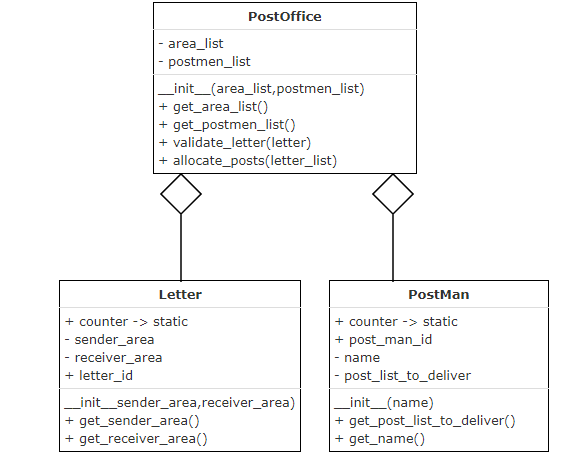
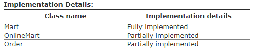
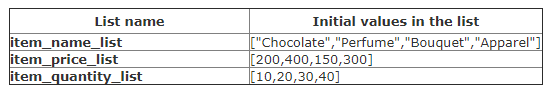

# 02. Post office 

- A post office wants to automate the process of allocation of letters to different postmen based on their allocated area. Write a python program to implement the class diagram given below.

## Class description

### Letter class:

Initialize static variable counter to 1
Auto-generate attribute, letter_id starting from 1 in the constructor
PostMan class:

Initialize static variable counter to 100
Auto-generate attribute, postman_id starting from 101 prefixed by “P” in the constructor
post_list_to_deliver: List of letter objects to be delivered by the postman

### PostOffice class:

- **area_list:** List of names of areas under the post office
- **postmen_list:** List of postman objects working in the post office. There is one to one correspondence between the two lists – which means postman at index position 0 delivers letters in the area at index position 0 of area_list
- **validate_letter(letter):** Accept the letter and validate its receiver area. If letter.receiver_area is present in area_list, return the index position of that area in area_list. Else return -1
- **allocate_posts(letter_list):** Allocate letters in the letter_list to the appropraie postman
    - For every letter in letter_list
        - Validate letter.receiver_area
        - If valid, append the letter to the corresponding postman's post_list_to_deliver
        - Else, add it to an invalid letter list
    - Return invalid letter list
Perform case sensitive comparison.
Create objects of Letter class, PostMan class and PostOffice class, invoke appropriate methods and test your program.

## 03. Mart

- ABC Mart has made its service online for few of the products available in the mart by providing additional online discount and with a feature of shipping the order to the customers through courier. The process of calculation of the order price and shipping the order request to customer and providing them tracking id process has to be automated.
- The class design for the same is given below.

## Notes:

- Do not include any extra instance/static variables instance/static methods in the given classes

- Case sensitive comparison is required to be done wherever applicable

- Do not change any value or case of the given variables

- Read notes and examples carefully for better understanding of the logic

## Order class:

### generate_tracking_id(): 

- This method auto generates the tracking_id (String) for each order successfully shipped.
- The tracking_id should be auto-generated from "TR1000" followed by "TR1001", "TR1002" and so on. I.e. first tracking_id should be "TR1000", the second should be "TR1001" and so on
- Use static variable counter (integer) appropriately for auto-generation logic

## Mart class:

- There are three static lists in this class. They are –
    - item_name_list: has the name of each item (string) available in the Mart
    - item_price_list: has the unit price (integer) of each item available in the Mart
    - item_quantity_list: has current quantity of each item (integer) available in the Mart.

- The initial values of these lists are as below –

- These lists have one to one correspondence. I.e. the unit price of "Bouquet" is Rs. 150/- and there are 30 pieces (quantity) available in the Mart

Note: Mart class is supplied. No need to code these lists. 

## OnlineMart class:

## check_item_availability():

- This method validates the item_name (string) of the order. This method also validates if the Mart has sufficient quantity_required (integer) in item_quantity_list for the given item_name of the order.
- Check if the item_name of the order is available in the item_name_list of the Mart class
If not available, return -1
Otherwise, check if sufficient quantity_required is available in item_quantity_list for the order.
If not available, return -1
Otherwise,
Update the item_quantity_list of Mart class by deducting the quantity_required from existing value
Return quantity_required for the order